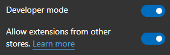
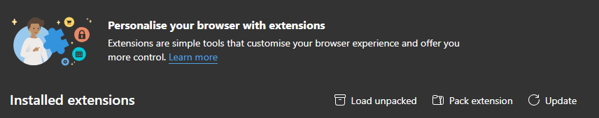

# GitHub Theme For Browsers

Noah (original author):
> I like the dark [VS Code GitHub Theme](https://marketplace.visualstudio.com/items?itemName=GitHub.github-vscode-theme) very much. So I created one for browsers.

Me: 
> I like the VS Code GitHub Theme too, but I prefer the selected tab text in white.

This version is forked from [GitHub Dark Theme](https://github.com/fnick851/github-theme-for-browsers) with a subtle change in the color scheme. The selected tab text is white instead of a red. I've only made this change in the Chrome extension.

## Installation

I've intentionally not published the extension as changing _just_ a single colour feels very naughty. So, to use this version you'll have to install the theme manually. Fortuneatyly, this is pretty simple!

### Edge

1) Go to Settings > Extensions > Manage Extensions
2) Turn on Developer Mode

3) Select "Load Unpacked"

4) Naviage to `chrome\theme` and click select folder

Done!! :octocat: More detailed documentation can be found on [Microsoft Learn](https://learn.microsoft.com/en-gb/deployedge/microsoft-edge-manage-extensions-webstore
).